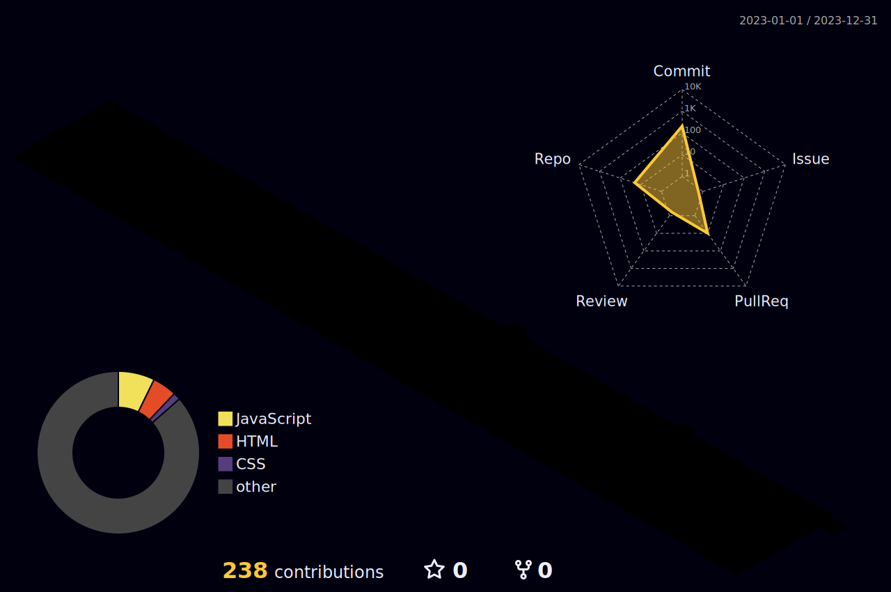

<body>
  

    <h1> Hi there, I'm Sheikh Hamza👋<a href="#"></h1>
  

  
  

<h3>I'm a Full Stack Developer, Teacher and Researcher!</h3>
  <ul>
    <li>🔭 I’m currently working as a Full Stack Developer.</li>
    <li>🌱 I’m currently expanding my knowledge in Machine learning and Cybersecurity.</li>
    <li>👯 I’m looking to collaborate with other content creators and developers.</li>
    <li>📢 Love to teach and inspire students. Taught more than 150+ students.</li>
    <li>🥅 2023-24 Goals: Contribute more to Open Source projects and Execute my Innovative ideas.</li>
    <li>💎 If you are a Tech boy/girl let's get connected</li>
  </ul>
<h1 align="center"> Connect with me: </h1>

 
<h2>Tech Stack</h2>

<table align='center'>
<tr>
<td align='center'>

</td>
<td align='center'>

</td>
<td align='center'>

</td>
<td align='center'>

</td>
</tr>
<tr>

<td align='center'>

</td>
<td align='center'>

</td>
<td align='center' width="200">

</td>
<td align='center' width="200">

</td>
</tr>
<tr>
<td align='center' width="200">

</td>
<td align='center' width="200">

</td>
<td align='center'>

</td>

<td align='center' width="200">

</td>
</tr>
<tr>	
<td align='center' width="200">

</td>
<td align='center' width="200">

</td>
<td align='center' width="200">

</td>
<td align='center' width="200">

</td>

</tr>
<tr>
<td align='center' width="200">

</td>

<td align='center' width="200">

</td>
<td align='center' width="200">

</td>
<td align='center'>

</td>
</tr>
</table>

<h2 align="center"><i>⚙ GitHub Analytics:</i></h2>

 

<table>
  <tr>
    <th>Stats</th>
    <th>Streak</th>
    <th>Languages</th>
  </tr>
  <tr>
    <td></td>
    <td></td>
    <td></td>
  </tr>
</table>

<h2 align="center"><i> ⚡️Github Contributions:</i></h2>

<h4 align="center">Isometric view of contributions in the last year</h4>

  

    
 

 
  Views 
  

 

<h2 align>Spotify Playing 🎧</h2>
    

    
